# Project

Đây là các thông tin về phần cứng của dự án:

### 1. Sơ đồ nguyên lý mô hình trồng nấm rơm (Schematic)
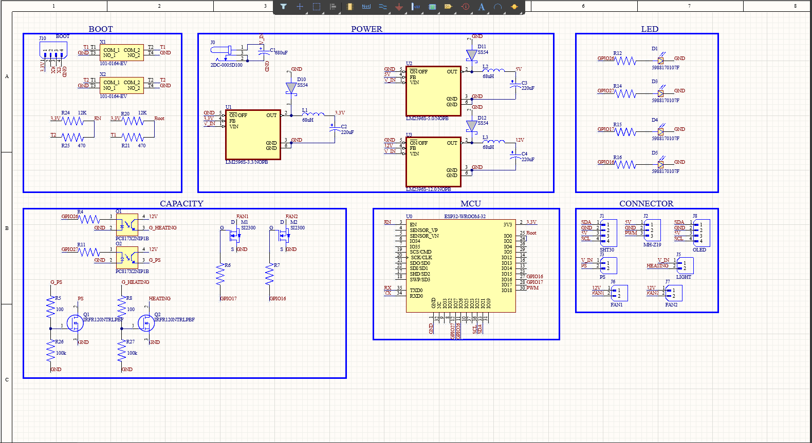

### 2. Mô hình trồng nấm rơm (PCB Design)
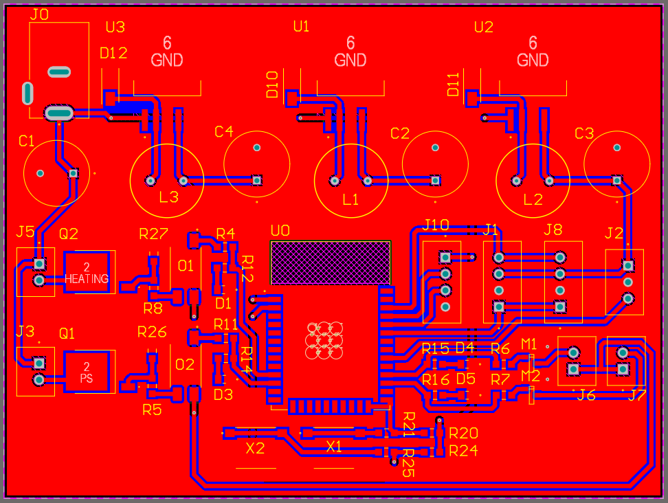

### 3. Mô hình thực tế
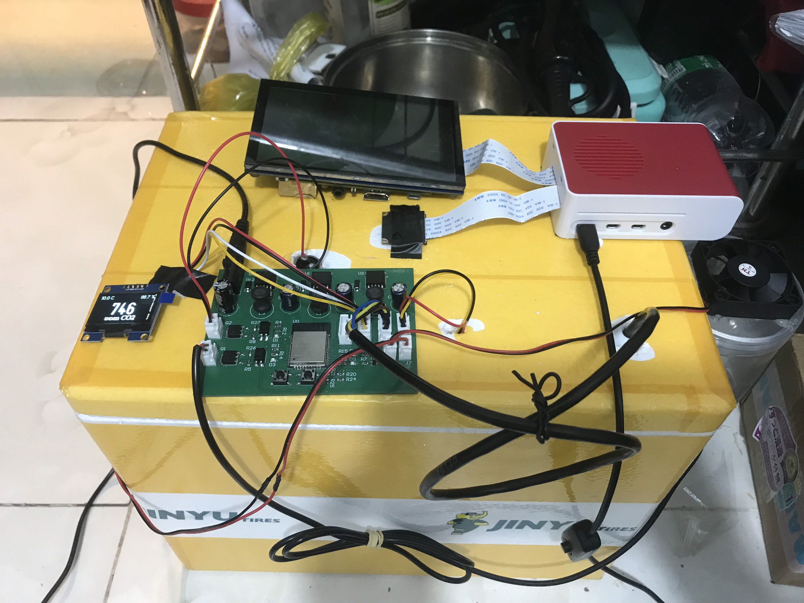

### 4. AutoDoor_ESP32-C3_RFID
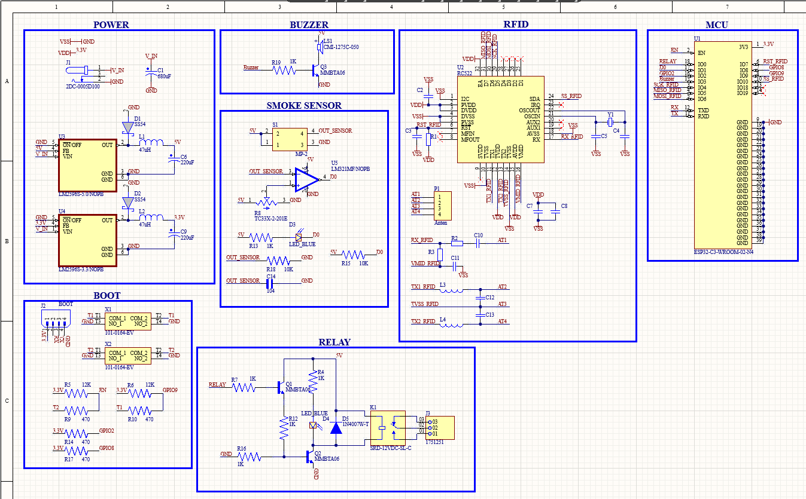
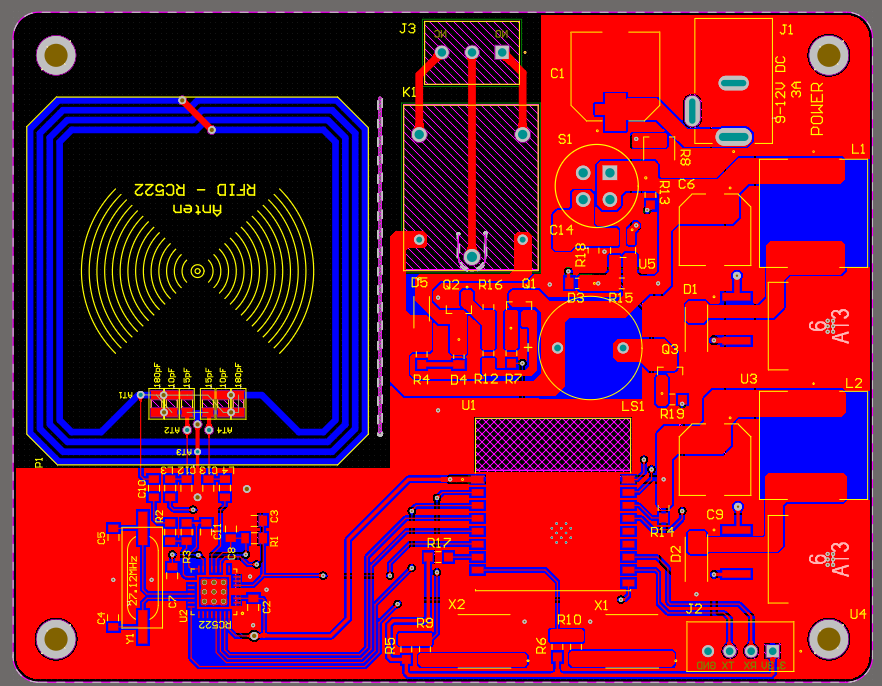
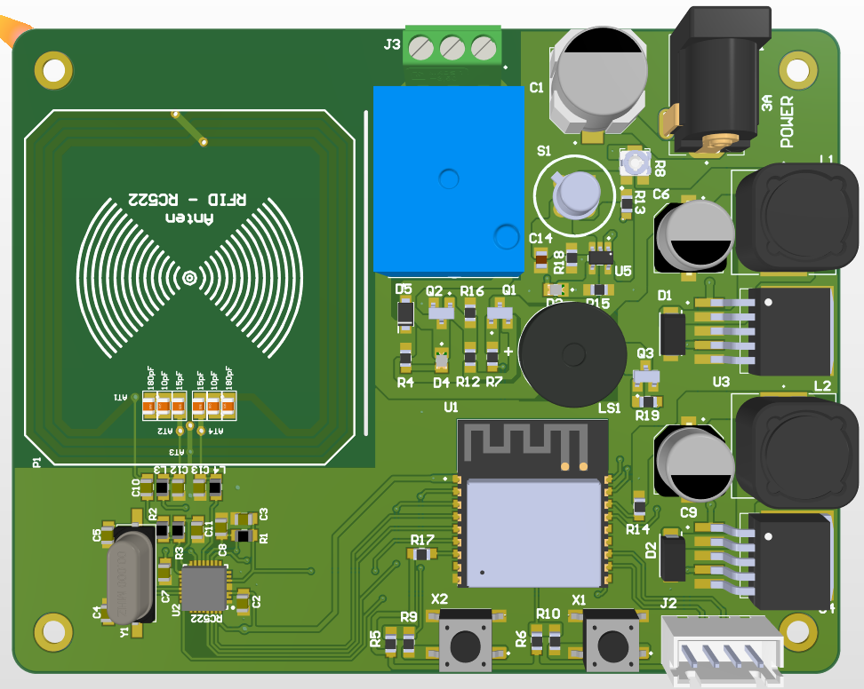
### 5. Power LM7805
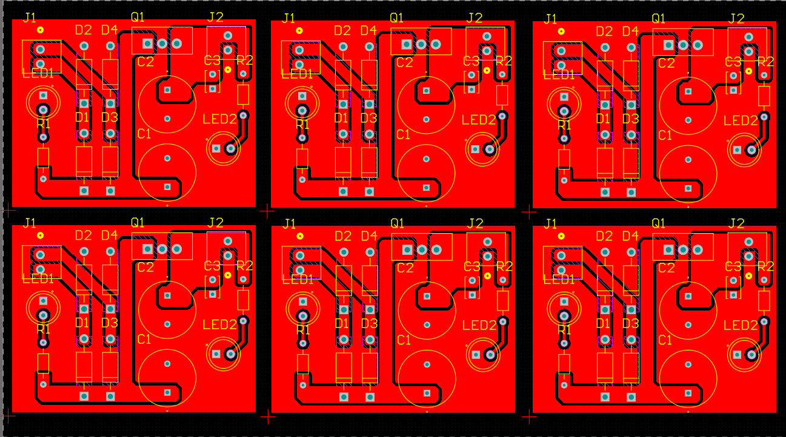
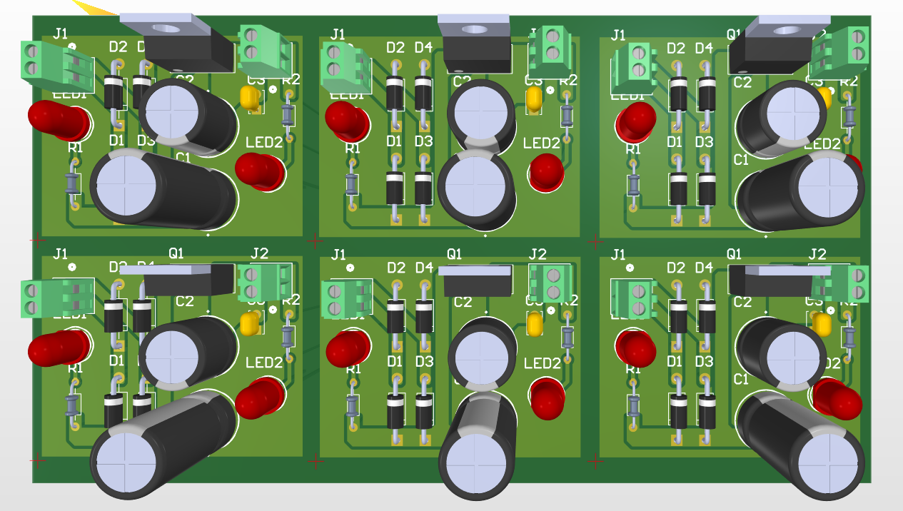
### 6. Đèn PUB65W
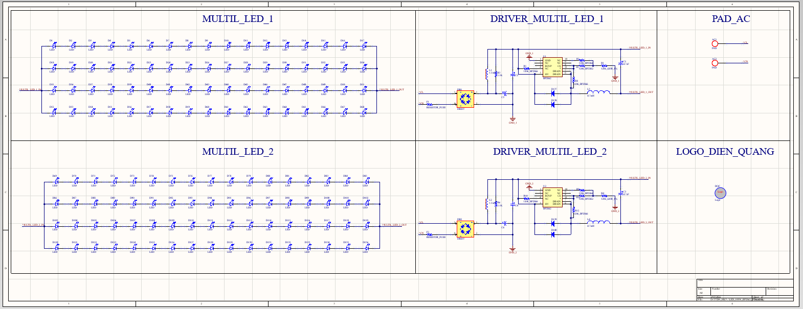
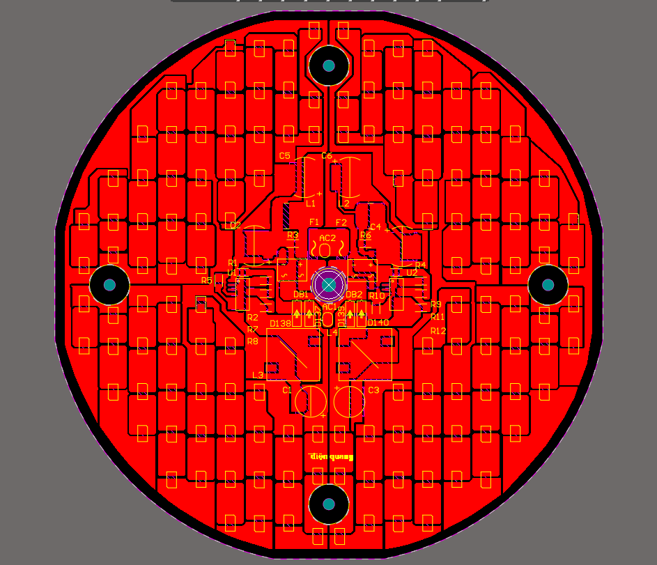
### 7. F28379D điều khiển động cơ 3pha
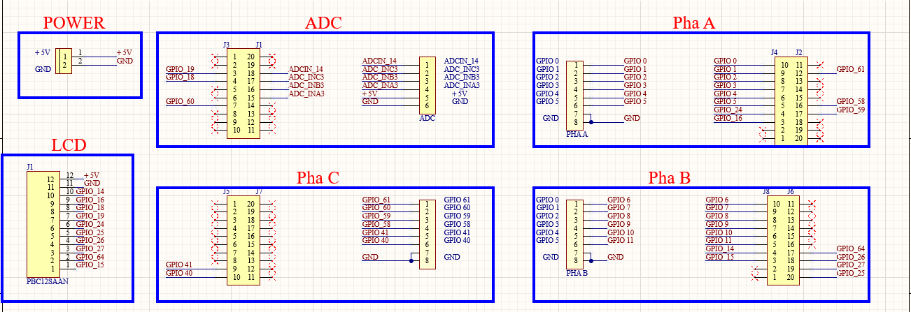
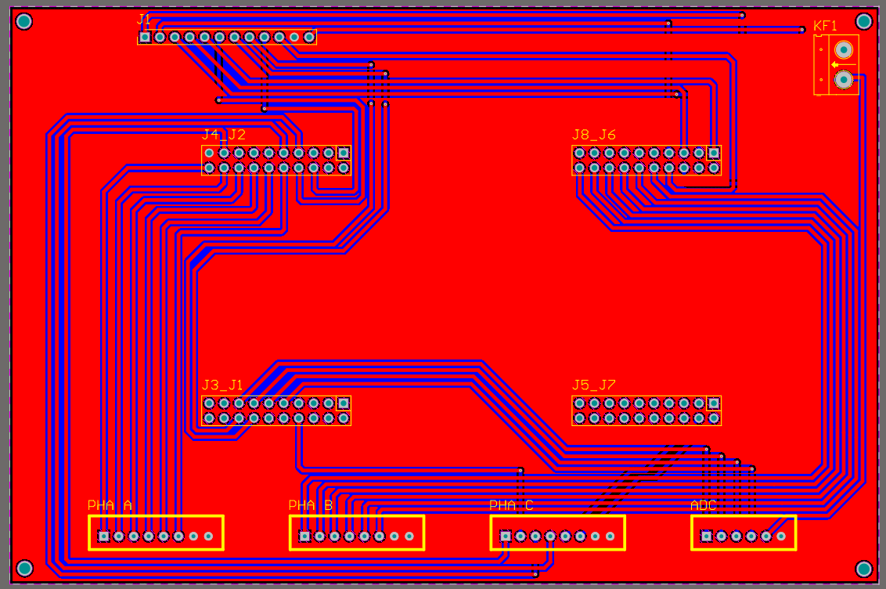
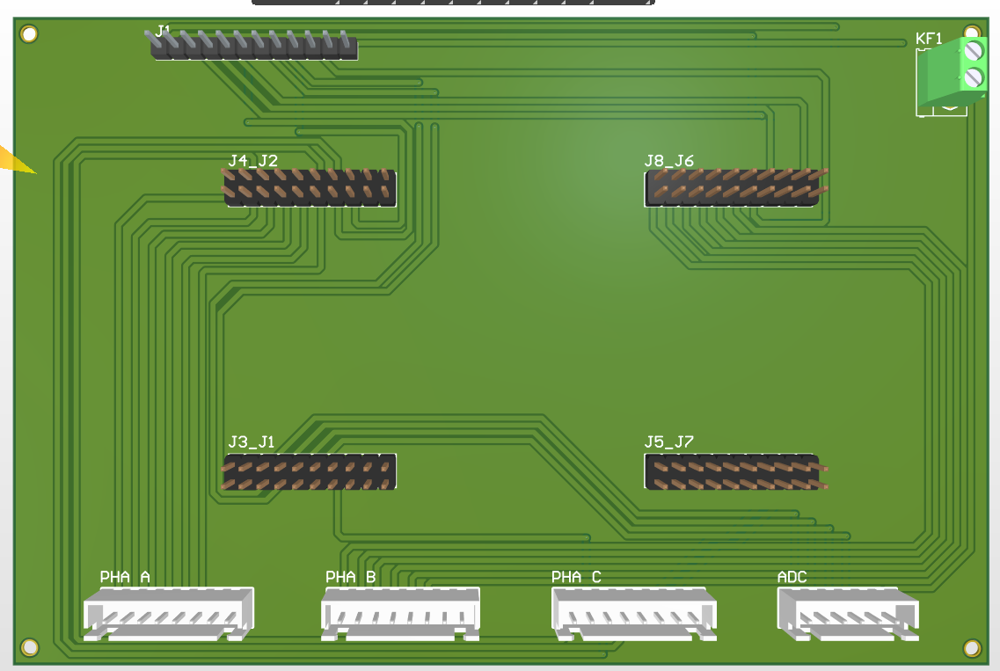
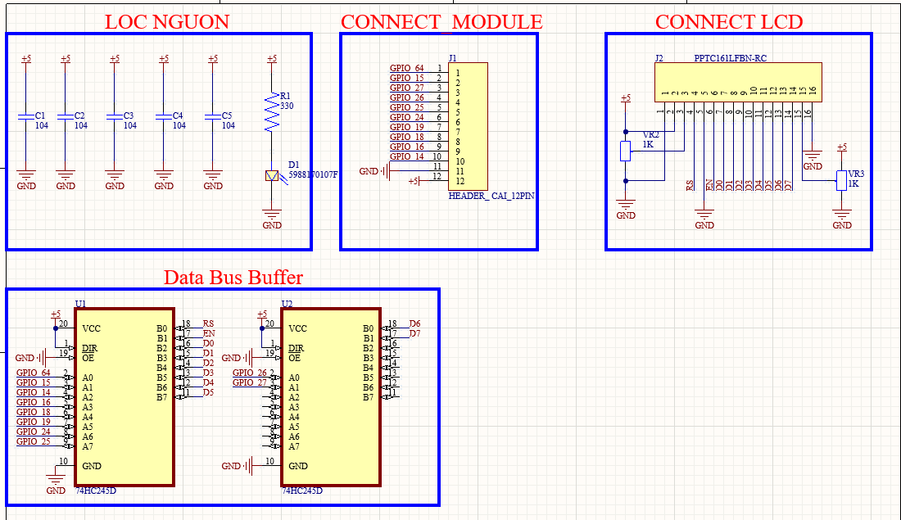

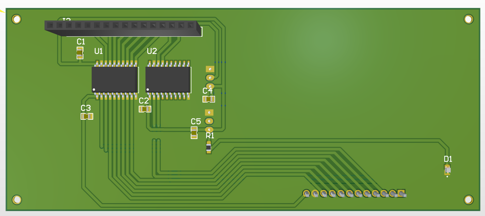
